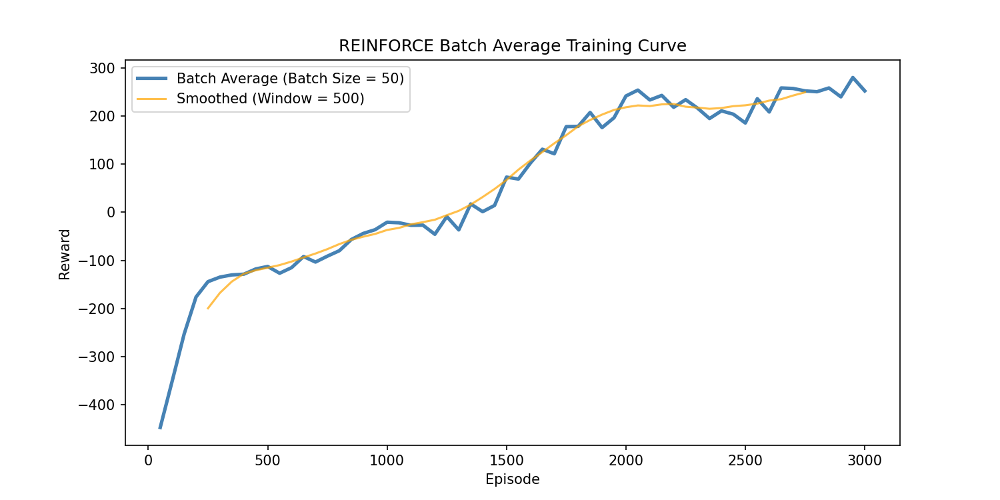
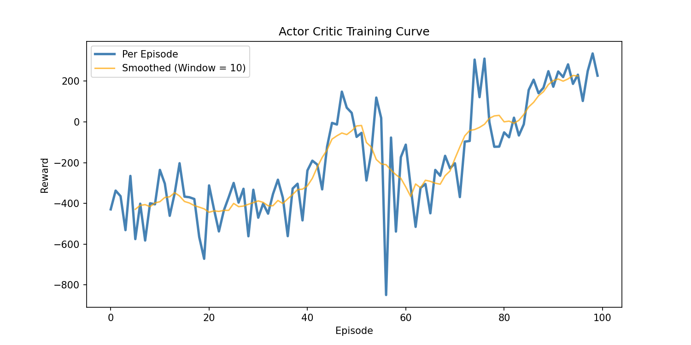
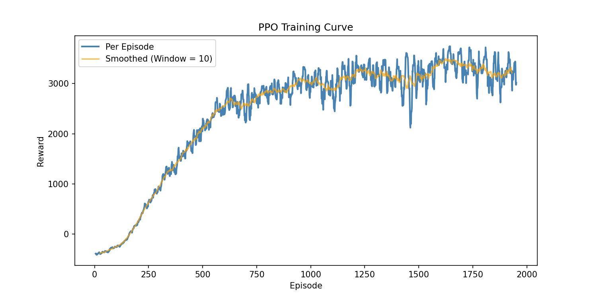

# Policy Gradient Exploration
Implementations of REINFORCE, Actor-Critic, and PPO from scratch with TensorFlow trained on HalfCheetah-v5

<div align="center">
  <br>
  
  <br>
  <em>Example evaluation of a model trained with ppo.py</em>
  <br>
</div>

## Summary of Results
PPO achieved the highest mean evaluation reward and also had the least variance. REINFORCE with baseline showed consistent but slower learning, while Actor Critic was very difficult to reliably train due to online single step updates.

<br>
<div align="center">
  
| Algorithm | Mean Reward | Standard Deviation | 
|-----------|-------------|---------|
| REINFORCE | 266.86 | 93.60 |
| Actor Critic | 198.12 | 58.61 |
| PPO | 3816.24 | 51.24 |

<em>Algorithm's best mean reward and standard deviation over 10 evaluation runs</em>
<br>
</div>

<br>

<div align="center">
  
  
  

<em>Training Curves</em>
<br>
</div>


## Project Structure
```
PolicyGradient_Exploration/
├── algorithms/
│   ├── reinforce.py
│   ├── actor_critic.py
│   └── ppo.py
├── configs/
│   ├── reinforce.yaml
│   ├── actor_critic.yaml
│   └── ppo.yaml
├── results/
├── plot.py
├── train.py
├── evaluate.py
├── requirements.txt
└── README.md
```
## Installation
```bash
pip install -r requirements.txt
```
## Usage
Train an algorithm:
```bash
python train.py --algorithm reinforce
python train.py --algorithm reinforce --config configs/reinforce_custom.yaml
```

Evaluate a trained agent:
```bash
python evaluate.py --algorithm actor_critic --path results/actor_critic/20240906_143022
```

Generate training curves:
```bash
python plot.py --algorithm ppo --path results/ppo/20240906_143022
```

Note: I chose to read in the full relative path as it's easy to copy within VS Code
